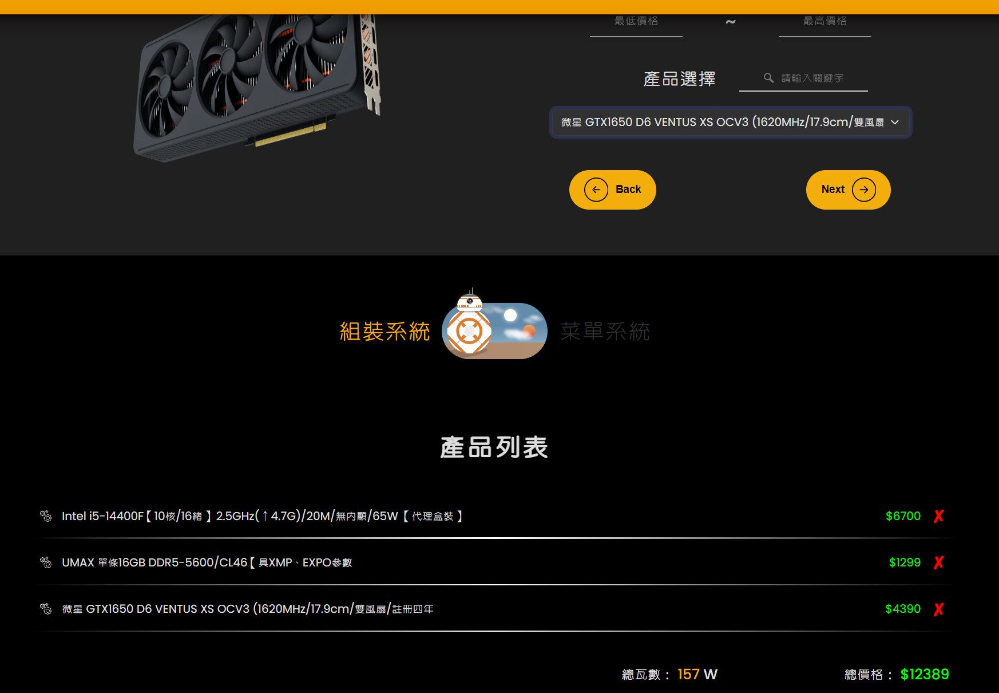
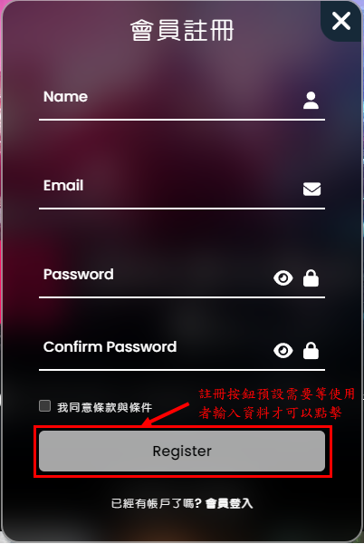
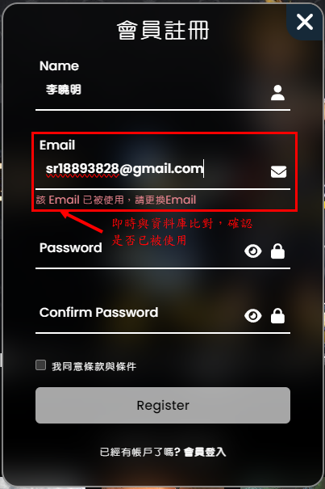
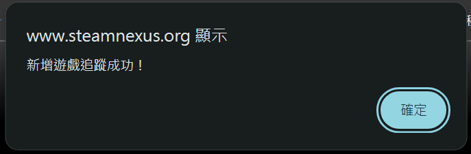
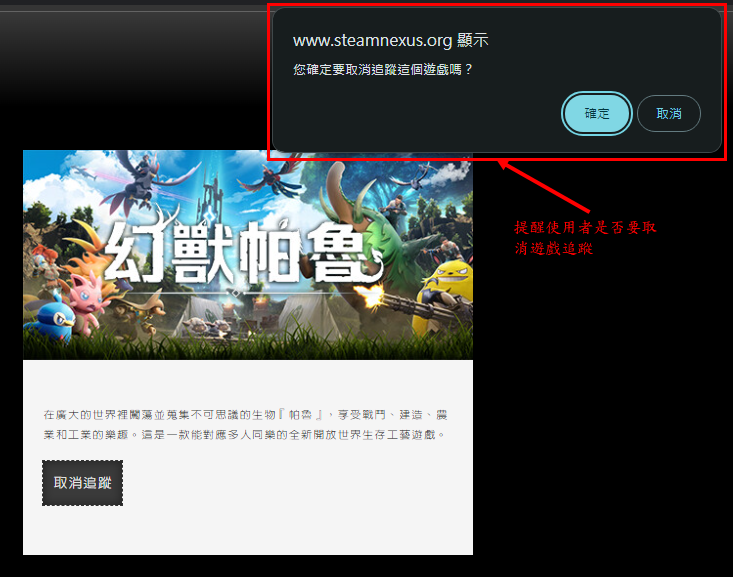
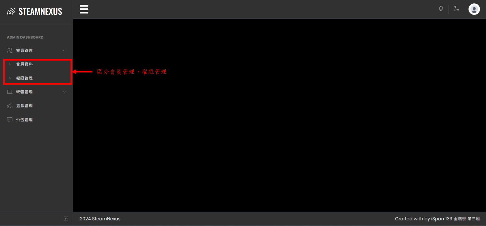
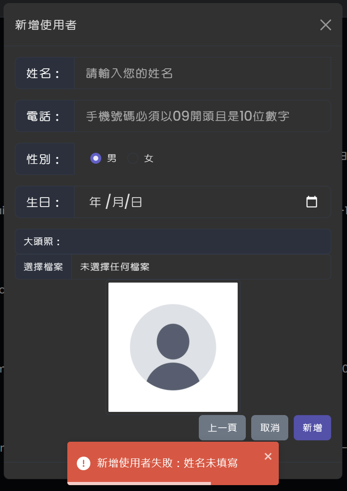

# SteamNexus

## 目錄

1. [專案介紹](#專案介紹)
2. [團隊成員與負責項目](#團隊成員與負責項目)
3. [技術棧](#技術棧)
4. [資料夾結構](#資料夾結構)
5. [安裝與運行](#安裝與運行)
6. [功能展示](#功能展示)
7. [未來展望](#未來展望)

## 專案介紹

SteamNexus 是一個單頁應用 (SPA)，旨在為用戶提供市面上數位遊戲的價格歷史圖，以及全面的遊戲電腦組裝解決方案。該專案採用 Vue.js 和 ASP.NET Core Web API 進行前後端分離的開發，並使用 Entity Framework Core 8 將資料持久化到 Microsoft SQL Server 資料庫。

網站上線網址：[https://www.steamnexus.org](https://www.steamnexus.org)

## 團隊成員與負責項目

### 郭炯德 [](https://github.com/Forestenvoy)

領導小組、統整意見及決策、專案開發時程管理、專案整合、資料庫構想、技術支援、導覽列頁尾視覺製作、遊戲電腦組裝系統前後台整體製作、前端整體路由及狀態管理、網站前後端部署

### 王俊婕 [](https://github.com/Gina628)

整體遊戲資訊抓取、每日定時更新、首頁製作、搜尋系統（關鍵字搜尋）、遊戲資訊系統前台後台視覺製作、技術支援

### 李憶承 [](https://github.com/sr18893828)

會員管理系統、遊戲收藏管理系統、會員登入註冊、會員前後台視覺製作

## 技術棧

- **前端**：Vue.js, Vue Router, Pinia, jQuery, Bootstrap
- **後端**：ASP.NET Core Web API
- **資料庫**：Microsoft SQL Server, Entity Framework Core 8
- **爬蟲技術**：C# (HtmlAgilityPack), Python (Request, BeautifulSoup)
- **雲端平台**：Azure
- **版本控制**：Git

## 資料夾結構

本專案初期為一個 ASP.NET Core MVC 項目，中期才全面轉換為 Vue.js、ASP.NET Core Web API 實作前後端分離的開發。

```plaintext
.
├── SteamNexus/            # 初學 ASP.NET Core MVC 的項目
│   ├── Controllers/       # 控制器
│   ├── Models/            # 模型
│   └── Views/             # 視圖
├── steamnexus_client/     # 前端項目 (Vue.js)
│   ├── src/               # 源代碼
│   │   ├── assets/        # 資源文件 (圖片、樣式等)
│   │   ├── components/    # Vue.js 組件
│   │   ├── router/        # 路由設定 (Vue Router)
│   │   ├── store/         # 狀態管理 (Pinia)
│   │   ├── views/         # 視圖
│   │   └── App.vue        # 主應用組件
│   ├── public/            # 靜態資源
│   ├── index.html         # 主 HTML 文件
│   └── package.json       # 項目配置文件
├── SteamNexus_Server/     # 後端項目 (ASP.NET Core Web API)
│   ├── Controllers/       # 控制器
│   ├── Models/            # 模型
|   ├── Dtos/              # 數據傳輸對象 (DTOs)
│   ├── Data/              # 數據庫上下文
│   ├── Migrations/        # 數據庫遷移
│   ├── Services/          # 服務
│   ├── appsettings.json   # 應用程序設置
│   └── Program.cs         # 程序入口
└── README.md              # 說明文件
```

## 安裝與運行

### 前端 (Vue Project)

1. 進入 `steamnexus_client` 資料夾：

   ```bash
   cd steamnexus_client
   ```

2. 安裝套件：

   ```bash
   npm install
   ```

3. 運行開發伺服器：

   ```bash
   npm run dev
   ```

### 後端 (ASP.NET Core Web API)

1. 進入 `SteamNexus_Server` 資料夾：

   ```bash
   cd SteamNexus_Server
   ```

2. 恢復 NuGet 套件：

   ```bash
   dotnet restore
   ```

3. 運行應用：

   ```bash
   dotnet run
   ```

## 功能展示

1. [遊戲資訊系統](#遊戲資訊系統)
2. [遊戲電腦組裝系統](#遊戲電腦組裝系統)
3. [會員系統](#會員系統)

### 遊戲資訊系統

### ＊首頁
#### 功能大綱
1. 公告系統
2. 類別系統
3. 遊戲總覽


#### 功能細部操作
1. 公告系統－可觀看線在Steam公告以及各遊戲公告
2. 類別系統－依照類別過濾遊戲


3. 遊戲總覽－滑動過去會顯示當前遊戲的部分資訊及遊戲影片,並且往下滑動會無限生成


4. 點選遊戲－點擊可跳轉業面


### ＊遊戲資訊頁面
#### 功能大綱
1. 遊戲資訊系統
2. 價格圖表
3. Steam引流
4. 推薦遊戲


#### 功能細部操作
1. 遊戲資訊系統－遊戲資訊呈現
2. 價格圖表－每日價格呈現、在線人數觀看、最低價格觀看


3. Steam引流－點擊可跳轉業面


4. 推薦遊戲－推薦相似遊戲(用相同標籤數量進行排序)


### ＊搜尋系統


### 遊戲電腦組裝系統

#### 前台

1. 導覽列上方點擊"遊戲電腦組裝"


2. 點擊開始可以使用組裝系統(可配合 Filter 過濾)


3.可以步驟式的選擇電腦零件，像是你有選 Intel 的 CPU，系統就會幫你篩選出 Intel 的主機板


4. 一選擇就會加入下方的產品列表，同時幫你計算總瓦數及價格



5. 當至少有選擇 CPU、GPU、RAM 時，即可啟動遊戲配備需求計算系統，即時去計算當前硬體配置可以滿足多少 Steam 遊戲的最低、建議配備


6. 可以點擊比例下方按鈕進去觀看實際可玩的遊戲列表，由於資料量大，有實作關鍵字搜尋及分頁功能，而點擊遊戲名稱即可前往網站的遊戲資訊系統


7. 如果不想一個一個選擇電腦零件，也有提供現成菜單可供選擇，一樣可以享受完整功能


#### 後台

1. 右上角登入管理員帳號，點擊"後台系統"


2. 側邊導覽列可以看到硬體系統


3. 點擊產品管理可以讀取各項分類的產品列表，如果瓦數有務也可以點擊編輯系統即時修正


4. 而需要更新時，可以點擊全部零件更新，會呼叫 Web API，啟動 C# 的 HtmlAgilityPack 對電腦零售商網站發送請求及解析，然後利用 LINQ 對資料進行處理後，新產品會寫入資料庫，已有產品則是進行資訊更新


5. 至於菜單系統，點擊側邊導覽列菜單管理可進入頁面看到前台上架的所有菜單


6. 新增菜單，點擊"新增菜單"按鈕，跳出新增菜單互動視窗


7. 編輯菜單，點擊菜單上的"編輯"按鈕，跳出編輯菜單互動視窗


8. 菜單上架，點擊 "上架" checkbox，返回前台即可看到成功上架的菜單；下架同理


9. 刪除菜單，此菜單就永遠的消失了~


### 會員系統

#### 前台

1. 導覽列上方點擊"登入"。


2. 在使用者登入畫面中，有設置簡易的會員註冊，所以使用者若沒有會員時，可以註冊後再使用。


3. 會員註冊時，帳號是使用Email進行註冊，當使用者輸入時，會即時比對資料庫，帳號是否已被使用；密碼有設置顯示/隱藏密碼功能，密碼與確認密碼即時比對的功能；在註冊按鈕有設定，若資料有錯誤無法點擊註冊案有。

   3.1 點擊註冊時，註冊按鈕預設是不能進行點擊。

   

   3.2 姓名是必填欄位，當使用者未輸入時，會即時提醒使用者。

   

   3.3 註冊的Email即時與資料庫比對，並提醒使用者是否可以使用。

   

   

   3.4 即時比對密碼與確認密碼是否一致。

   

   3.5 當有即時訊息有出現錯誤時，無法點擊註冊按鈕

   

   

   

   3.6 密碼欄位設定顯示/隱藏功能。

   

   3.7 會員註冊後，畫面會跳轉到登入畫面，利於使用者註冊完成後即可進行登入，並會有提示說明註冊已成功。

   

   

4. 會員登入畫面，在密碼欄位設置顯示/隱藏密碼功能，另當使用者登入時，會顯示使用者登入的訊息。

使用者登入畫面：


使用者登入提醒：


5. 在註冊時是簡易註冊，會員登入後，可以至會員中心修改會員資料、大頭貼、密碼等資訊，另外會員登入後，會提醒使用者已經登入。

點擊大頭貼圖示，進入會員中心。


會員基本資料更改畫面：

基本資料修改：


密碼修改：


   5.1 大頭照註冊時是使用預設圖片，所以註冊後可以到會員中心進行修改；另外的基本資料也都可以在這邊進行修正。

   

   5.1.1 會員修改成功後提示訊息。

   

   5.1.2 登入的大頭照一開始是使用預設，如有變更大頭照，導覽列的大頭照也會進行改變。

   

   5.2 會員密碼修改需要先輸入舊密碼與新密碼才能夠修改；密碼也都附有顯示/隱藏密碼的功能。

   5.2.1 新密碼與舊密碼設置即時比對。

   

   5.2.2 密碼都設有顯示/隱藏功能。

   

   5.2.3 修改完成後提示訊息。

   

6. 會員遊戲收藏功能

   6.1 進入遊戲內容點選收藏功能。

   

   6.1.1 新增追蹤後提示訊息。

   

   6.1.2 重複追蹤提示訊息。

   

   6.2 取消追蹤時，會再次提醒使用者是否要取消追蹤，當使用者選擇確定取消追蹤時，會再追蹤列表中進行刪除，並即時更新畫面；當使用者選擇取消時，則不進行刪除。

   

   

7. 會員設置一般會員與系統管理者，所以在導覽列進行登入時，當登入者為一般會員時，則會隱藏"後台系統"；反之若登入的為系統管理者，則會顯示"後臺系統"。

   7.1 一般會員導覽列

   

   7.2 系統管理者導覽列

   

#### 後台

1. 管理者登入系統後，選擇"後台系統"進入後台頁面。


2. 會員管理系統區分為會員管理與權限管理。




3. 會員管理系統可以使用CRUD進行資料的編輯與刪除，在編輯畫面中，不能夠編輯會員編號與帳號，因為這兩者都是唯一值，所以不能進行變更。

   3.1 會員資料列表：

   

   3.2 會員資料編輯與刪除功能：

   

   3.2.1 會員編輯功能：

   會員編號與帳號不能夠進行編輯。

   

   會員資料編輯與編輯成功訊息

   

   

   3.2.2 會員刪除功能：

   刪除使用者時，會先提醒系統管理員是否要刪除使用者。

   

   刪除成功時，提醒訊息。

   

   3.3 新增會員功能：

   註冊畫面分為兩部分：第一部分：帳號與密碼資料、第二部分：基本資料的填寫，但是除了姓名要填寫外，其餘資料皆可不用填寫。

   3.3.1 第一部分：未填寫資料時，不能點擊按鈕進入第二部分。

   

   Email即時比對資料庫，是否已經有人使用

   

   

   密碼與確認密碼即時比對是否一致

   

   當Email與密碼其中一個有錯誤訊息時，無法點擊下一頁

   

   

   當沒有錯誤訊息時，方可點擊下一頁，進入第二部分的基本資料填寫

   

   第二部分基本資料填寫時，若姓名未填寫當管理員選擇新增時，會提醒管理員要填寫姓名，其餘資料皆可不用填寫。

   

   新增使用者後提示訊息

   

   

4. 權限管理可以進行新增與刪除功能，但是在刪除功能若有資料關聯性，則不能進行刪除。

   4.1 權限管理列表：

   

   4.2 權限刪除功能：

   

   4.2.1 當管理者刪除權限時，會先提醒管理者是否要刪除此權限；倘若此權限有關連性時，也不能夠進行刪除。

   再次確認是否要刪除權限。

   

   提醒管理者權限有關聯性，故無法刪除權限。

   

   刪除權限成功時，提醒使用者刪除成功訊息

   

   4.3 權限新增功能：

   

   4.3.1 新增權限時，管理者未輸入資料時，不能夠點擊新增按鈕。

   

   4.3.2 當權限輸入非英文時，會提醒使用者請輸入英文。

   

   4.3.3 當權限輸入英文時，則會即時比對資料庫名稱是否可以使用，不區分大小寫。

   

   

   4.3.4 權限新增成功訊息。

   

## 未來展望

- 優化前後端性能，縮短響應時間
- 後端引用日誌模組，紀錄服務的執行狀況
- 導入容器化技術 Docker、Kubernetes
- 加入自動化測試，提升系統的穩定性和可靠性
